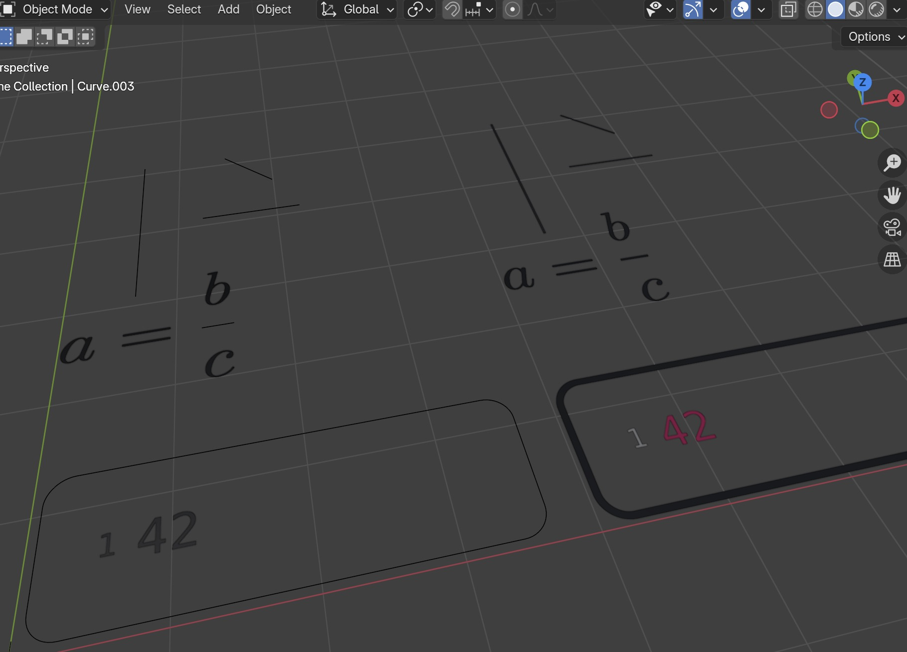

# Changelog

## v0.2.2

* Update to typst version 0.14.4
  https://github.com/messense/typst-py/releases/tag/v0.14.4
  

## v0.2.1

* Better Grease Pencil support
* "Jump" Geometry Nodes Operator
* New user interface

## v0.2.0

* Use Typst version 0.14.1 
* use lxml-6.0.2
* use svg_path-7.0

## v0.1.14

- use latest typst-py version: https://github.com/messense/typst-py/tree/v0.13.2

## v0.1.13

- Better release workflow
- New tutorial


## v0.1.12

- Import every new curve as "n" instead of "Curve"
- new interface for animation in sthe side panel.
- Possible to align multiple collections at once.
- "Shift+F" to align objects

## v0.1.9,  v0.1.10, v0.1.11

- try new publishing workflow

## v0.1.8
- rename "my_opacity" to "opacity"
- Use an emission shader instead of principled bsdf, so that the text is not effected by scene light:


## v0.1.7

* Change blend_method for transparency. "Dithered" looks more grany, and the new default "Blended" looks smoother.

* update to typst 0.13.1
* 
* Added object indices support with blue numbered labels.

```py
from typst_importer.typst_to_svg import typst_express

content = "$ a = b + c $" 
c = typst_express(content, origin_to_char=True, show_indices=True, 
position=(0, 2, 0), name="Simple")
```


```py
content = "$ limits(integral)_a^b f(x) dif x $" 
c = typst_express(content, origin_to_char=True, show_indices=True, 
name="Integral")
```


## v0.1.5

* update to typst 0.13.0
  
## v 0.1.4

* new position argument:

* add "Allign Object" operator.  Keyboard shortcut j, or  "Object -> Allign Object (XY)"
* add "Allign Collection". Keyboard shortcut l, or "Object -> Allign Collection (XY)" 

```py
typst_express(
    "hi",
    name="Example",
    position=(2, 2, 0),  # Place 2 units to the right
)
```
* Extra: Here's a snippet to position equation:
```py
from typst_importer.typst_to_svg import typst_express
def eq(equation: str, name: str, color: str, position=(0, 0, 0)):

    typst_code = f"""
    #set text({color})
    $ {equation} $
    """
    collection = typst_express(
        typst_code,
        origin_to_char=True,
        convert_to_mesh=True,
        name=name,
        position=position
    )

    return collection


eq("a -b = c", "Start", "aqua", (0, -4, 0.5))
eq("a - 3 r_(beta) = c", "End", "olive", (0, -4, 0));
```


## v 0.1.3

added `lxml` dependency

## v 0.1.2

* new function: convert from curve to mesh : `convert_to_mesh`
```py
c = typst_express("$ . . . $", scale_factor=100, origin_to_char=False, convert_to_mesh=True)
```
* Better handeling of materials. (see https://projects.blender.org/blender/blender/issues/134451)
* Every element has now a default "opacity" property


## v 0.1.1

* add new function: `c.processed_svg`
```py
from typst_importer.typst_to_svg import typst_express
from typst_importer.notebook_utils import display_svg
c = typst_express("""
#set math.lr(size: 80%)
$ integral.triple _V (nabla dot accent(F, arrow)) dif V = integral.surf_(partial V)  (accent(F, arrow) dot accent(n, arrow)) dif A $
"""
)
display_svg(c.processed_svg, width="400px")
```


* New docs at: https://kolibril13.github.io/bpy-gallery/n2typst_examples/

* new thumbnail

## v 0.1.0
### New Features
* Added customizable scaling and positioning options to `typst_express`:
  - `scale_factor`: Control the size of the rendered output (default: 100.0)
  - `origin_to_char`: Option to adjust origin point relative to characters (default: False)
```py
def typst_express(
    content: str,
    name: str = "typst_expr",
    header: str = "",
    scale_factor: float = 100.0,
    origin_to_char: bool = False
)
```

For example
```py
from typst_importer.typst_to_svg import typst_express
typst_express("$ a = b/d $" , scale_factor=200, origin_to_char=True)
```


* `get_curve_collection_bounds` will get the deminsons of a collection, e.g. 
```py
from typst_importer.typst_to_svg import typst_express
from typst_importer.curve_utils import get_curve_collection_bounds
c = typst_express("$ a = b/d$", scale_factor=100, origin_to_char=False)
min_p, max_p = get_curve_collection_bounds(c)
print(min_p, max_p)
# out <Vector (0.0249, -0.2190, 0.0000)> <Vector (1.4839, 0.5474, 0.0000)>
```
* `shift_scene_content` will shift all scene_content to a new position except the given collection c.
```py
from typst_importer.typst_to_svg import typst_express
from typst_importer.curve_utils import shift_scene_content

c = typst_express("$ a = b/d$", scale_factor=100, origin_to_char=False)
shift_scene_content(c)  

```
### Improvements
* Enhanced SVG preprocessing pipeline:
  - `flatten_svg` will flatten the SVG structure fist
  - `stroke_to_filled_path` will convert all strokes to paths.

Before <-> After:



```py
from typst_importer.svg_preprocessing import  flatten_svg, stroke_to_filled_path
svg_content = open("test.svg").read()
svg_content = flatten_svg(svg_content)
svg_content = stroke_to_filled_path(svg_content)

open("test_filled.svg", "w").write(svg_content)
```
or combined as `preprocess_svg`
```py
from typst_importer.svg_preprocessing import preprocess_svg
svg_content = open("test.svg").read()
svg_content = preprocess_svg(svg_content)
open("test_filled.svg", "w").write(svg_content)
```

### Developer Tools
* Added new notebook utilities for easier development and testing:
  - `display_svg` function to display svgs in Jupyter.

```py
from typst_importer.notebook_utils import display_svg
display_svg(step1_content , width='500px')
```


### Documentation
* Added examples for new features
## v 0.0.7

* fix problem with vertical strokes
* new thumbnail
* Apply all transformations
* new helper function `from typst_importer.curve_utils import get_curve_collection_bounds` in order to transform equations.
* new function `from typst_importer.curve_utils import shift_scene_content`
  
## v 0.0.6 

* `from typst_importer.typst_to_svg import typst_express`
* `from typst_importer.typst_to_svg import typst_to_blender_curves` 
* Improved support for code blocks, addressing issues in the SVG algorithm
* Enhanced documentation
* Experimentation with Greace Pencil Curve
* Debugging notebook


## v 0.0.5
* add support for both .typ and .txt
* Add Color support for Typst Equations (https://github.com/kolibril13/blender_typst_importer/pull/2)
* Better handeling for strokes, e.g. in an equation like a/b.


## v 0.0.4 
* better packaging

## v 0.0.3 

* Add Drag'n drop support
