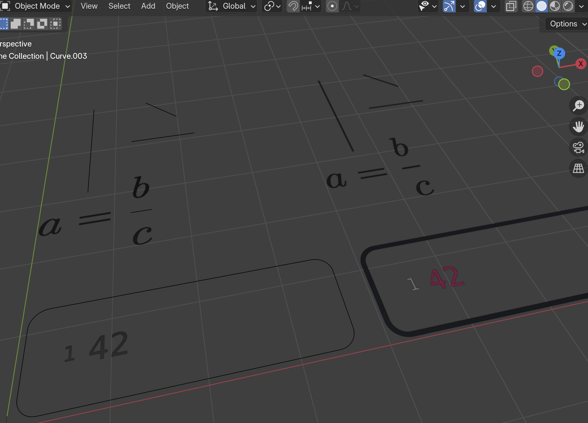

# Blender Typst Importer

A Blender extension to render Typst files.

## Usage

1. **Prepare a Typst File**  
   Create a `.txt` file and write your Typst code in it. For more on Typst, check out https://github.com/typst/typst.

   Example Typst `hello.txt` code:

```typst
#set page(width: auto, height: auto, margin: 0cm, fill: none)
#set text(size: 50pt)
$ sum_(k=1)^n k = (n(n+1)) / 2 $
```


2. **Import the File into Blender**
   - Drag and drop `.txt` or `.typ` files directly into Blender.
   - Alternatively, go to **File -> Import -> Typst 🦢 via (.txt/.typ)**.


## API usage


```py
from typst_importer.typst_to_svg import typst_express
typst_express("$ a = b/c $")
```


```py
from typst_importer.typst_to_svg import typst_express
content = "$ limits(integral)_a^b f(x) dif x $" 
typst_express(content, name="Integral Example")
```


```py
typst_express("""
#let korange() = text(fill: orange)[$k$]
#let nblue() = text(fill: blue)[$n$]
$ sum_(#korange() = 1)^#nblue() #korange() = (nblue()(nblue()+1)) / 2 $  
""")
```


````py
typst_express("""
#set page(width: 900pt, height: auto, margin: 0cm, fill: none)

#import "@preview/codelst:2.0.1": sourcecode
#import "@preview/tablex:0.0.8": tablex
#let sourcecode = sourcecode.with(frame: (code) => block(
  radius: 5pt,
  stroke: luma(30),
  inset: 30pt,
  text(size: 30pt, code)
))

#sourcecode[```python
for i in range(0,10):
  print(i)
```]
""")
````


<!-- ### Equation as Greace Pencil Curve (still in development) -->


<!-- ### Equation as image (still in development) -->


# Changelog


## v 0.1.0
### New Features
* Added customizable scaling and positioning options to `typst_express`:
  - `scale_factor`: Control the size of the rendered output (default: 100.0)
  - `origin_to_char`: Option to adjust origin point relative to characters (default: False)
```py
def typst_express(
    content: str,
    name: str = "typst_expr",
    header: str = "",
    scale_factor: float = 100.0,
    origin_to_char: bool = False
)
```

For example
```py
from typst_importer.typst_to_svg import typst_express
typst_express("$ a = b/d $" , scale_factor=200, origin_to_char=True)
```


### Improvements
* Enhanced SVG preprocessing pipeline:
  - `preprocess_svg` will flatten the SVG structure fist
  - `stroke_to_filled_path` will convert all strokes to paths.

Before <-> After:



```py
from typst_importer.svg_preprocessing import stroke_to_filled_path, flatten_svg
svg_content = open("test.svg").read()
svg_content = flatten_svg(svg_content)
svg_content = stroke_to_filled_path(svg_content)

open("test_filled.svg", "w").write(svg_content)
```
or combined as
```py
from typst_importer.svg_preprocessing import preprocess_svg
svg_content = open("test.svg").read()
svg_content = preprocess_svg(svg_content)
open("test_filled.svg", "w").write(svg_content)
```

### Developer Tools
* Added new notebook utilities for easier development and testing:
  - `display_svg` function to display svgs in Jupyter.

```py
from typst_importer.notebook_utils import display_svg
display_svg(step1_content , width='500px')
```


### Documentation
* Added examples for new features
## v 0.0.7

* fix problem with vertical strokes
* new thumbnail
* Apply all transformations
* new helper function `from typst_importer.curve_utils import get_curve_collection_bounds` in order to transform equations.
* new function `from typst_importer.curve_utils import shift_scene_content`
  
## v 0.0.6 

* `from typst_importer.typst_to_svg import typst_express`
* `from typst_importer.typst_to_svg import typst_to_blender_curves` 
* Improved support for code blocks, addressing issues in the SVG algorithm
* Enhanced documentation
* Experimentation with Greace Pencil Curve
* Debugging notebook


## v 0.0.5
* add support for both .typ and .txt
* Add Color support for Typst Equations (https://github.com/kolibril13/blender_typst_importer/pull/2)
* Better handeling for strokes, e.g. in an equation like a/b.


## v 0.0.4 
* better packaging

## v 0.0.3 

* Add Drag'n drop support
